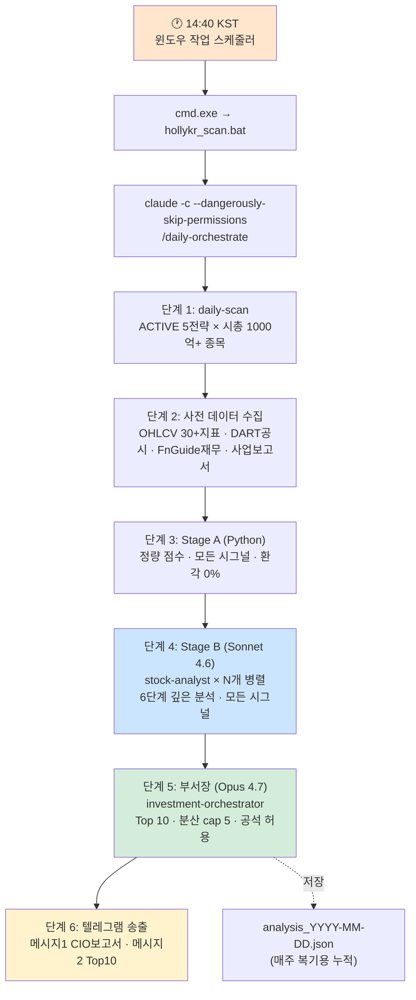
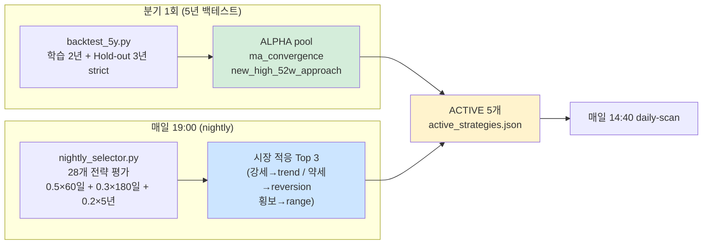
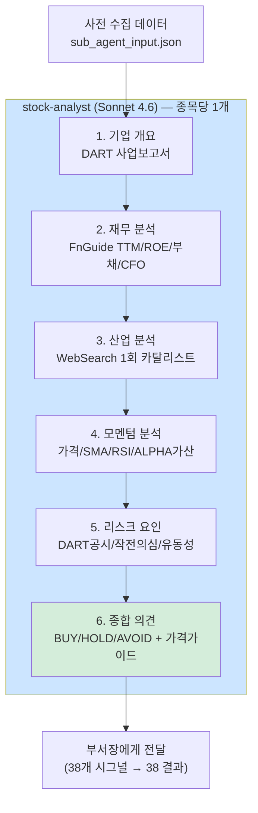
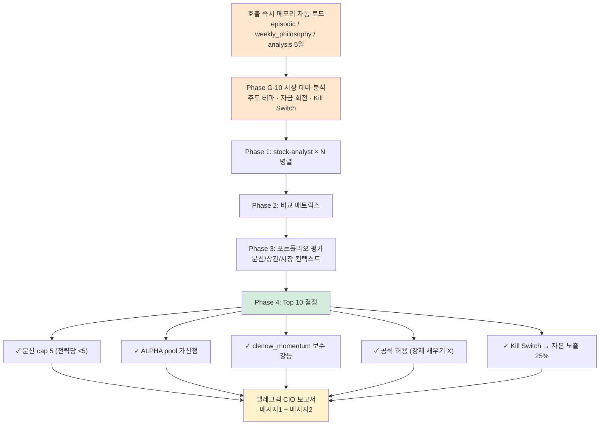
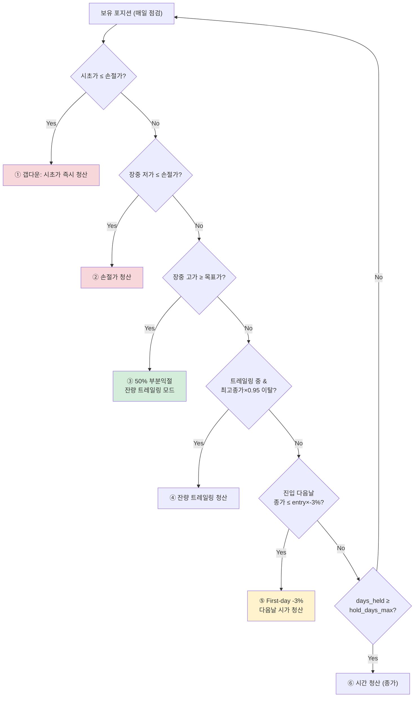
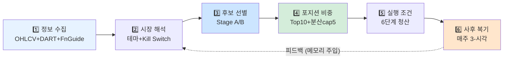
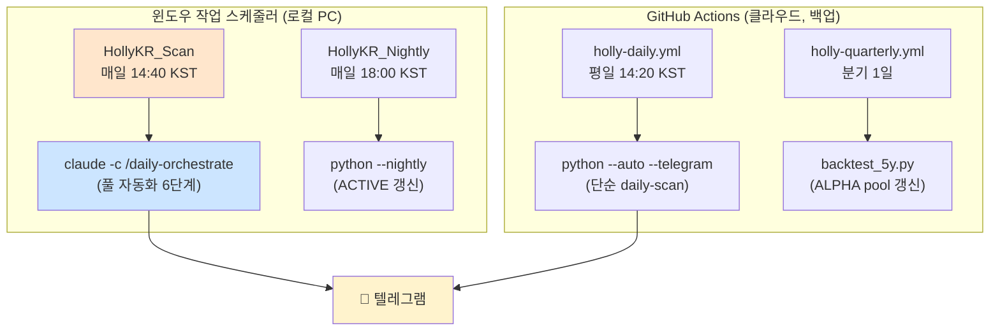
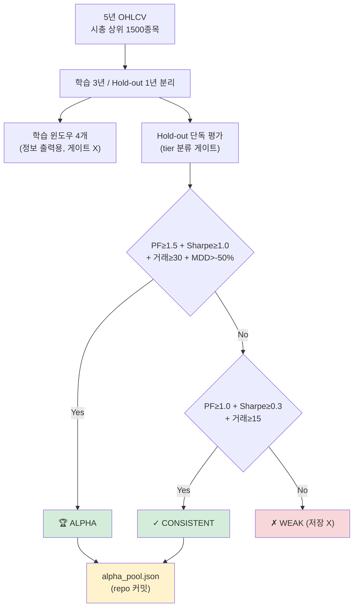
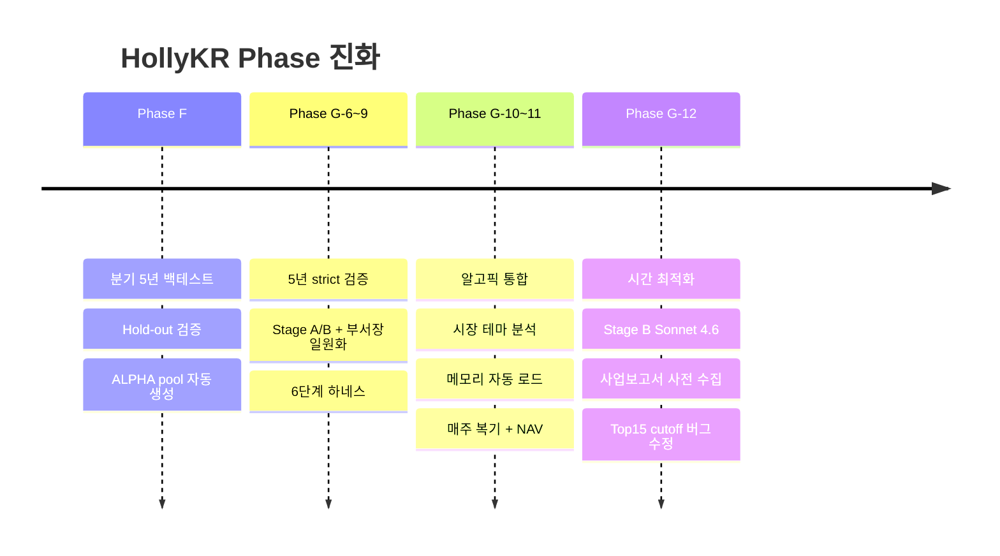

# HollyKR 아키텍처 (시각 정리)

> 지금까지 구축한 알고리즘을 다이어그램으로 정리. GitHub에서 자동 렌더링됩니다.

---

## 1. 전체 일일 파이프라인

---

## 2. ACTIVE 전략 동적 선정 (시장 적응)

---

## 3. Stage B 6단계 분석 프레임워크

---

## 4. 부서장 의사결정 (CIO)

---

## 5. 청산 6단계 우선순위 (백테스트 ↔ 실전 동일)

---

## 6. 6단계 운용 하네스

알고픽 인사이트: *"AI 투자 에이전트의 경쟁력은 모델이 아니라 하네스에서 나온다."*

---

## 7. 자동화 트리거 구조

---

## 8. 분기 5년 백테스트 → ALPHA pool

---

## 작업 히스토리 (주요 개선)

### Phase G-12 주요 수정 내역

| 항목 | Before | After |
|---|---|---|
| Stage A→B cutoff | Top 15로 자름 (룰 위반) | **모든 시그널 평가** (룰 3 준수) |
| Stage B 모델 | Opus 4.7 | Sonnet 4.6 (속도 ↑) |
| 부서장 prompt | 467줄 | 214줄 압축 (Opus 유지) |
| 기업 개요 출처 | Sonnet 학습 데이터 | DART 사업보고서 사전 수집 |
| 자동화 | GitHub Actions만 | 윈도우 스케줄러 + Claude Code CLI |

---

> 📌 이 문서는 시각적 이해용 요약입니다. 상세 구현은 [`CLAUDE.md`](CLAUDE.md), 개요는 [`README.md`](README.md) 참조.
